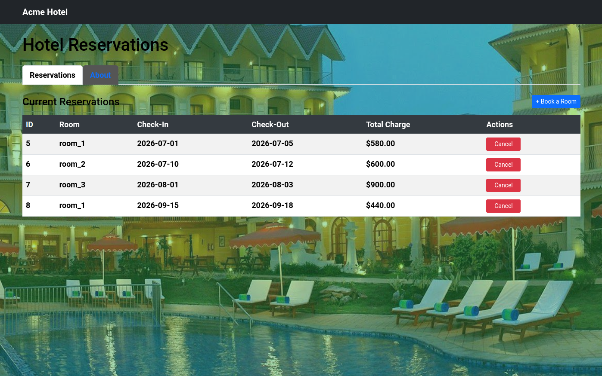

# Hotel Reservation Angular + Spring Boot Example - TypeScript / Java

**JavaScript, Angular 17, NgRx 17, Bootstrap 5, TypeScript, Java, Spring Boot 3, Spring for GraphQL, Spring Security (JWT), Spring Data JPA, PostgreSQL**

[](https://github.com/WillSams/example-js-angular-with-java/actions/workflows/pr-validate.yml)

This example contains a frontend and backend:

- The frontend is an [Angular 17](https://angular.dev) application using [Bootstrap 5](https://getbootstrap.com/docs/5.3/) for view designs, with [NgRx](https://ngrx.io) for state management.
- The backend is a [GraphQL API](https://graphql.org) built with [Spring Boot 3](https://spring.io/projects/spring-boot) providing the ability to create, delete, and list reservations plus available rooms.

This is a Java/Angular mirror of the [React/Python version](https://github.com/WillSams/example-js-react-with-python) of the same application.

**Context**:

- When a room is reserved, it cannot be reserved by another guest on overlapping dates.
- Check-in date must be in the future.
- Final price for reservations is determined by daily price * number of nights, plus the cleaning fee.

**Web UI Usage**:



**API Usage**:

Example usage via [curl](https://curl.se/download.html):

```bash
# First, grab an access token provided by the API
ACCESS_TOKEN=$(curl -s -X POST \
  -H 'accept: application/json' \
  -H 'Content-Type: application/x-www-form-urlencoded' \
  -d 'grant_type=password&username=example-user&password=example-user' \
  "http://localhost:$RESERVATION_PORT/development/token" | jq -r '.access_token')

# List all existing booked reservations
curl http://localhost:$RESERVATION_PORT/graphql \
    -H 'Content-Type: application/json' \
    -H "Authorization: Bearer ${ACCESS_TOKEN}" \
    -d '{"query": "query { getAllReservations { reservations { room_id checkin_date checkout_date } } }"}'

# Create a new reservation
curl http://localhost:$RESERVATION_PORT/graphql \
    -H 'Content-Type: application/json' \
    -H "Authorization: Bearer ${ACCESS_TOKEN}" \
    -d '{"query": "mutation { createReservation(input: { room_id: \"room_1\", checkin_date: \"2026-12-31\", checkout_date: \"2027-01-02\" }) { success errors reservations { id room_id checkin_date checkout_date total_charge } } }"}'

# Delete a reservation
curl http://localhost:$RESERVATION_PORT/graphql \
    -H 'Content-Type: application/json' \
    -H "Authorization: Bearer ${ACCESS_TOKEN}" \
    -d '{"query": "mutation { deleteReservation(reservationId: 1) { success errors } }"}'
```

**GraphiQL Playground**:

Navigate to [http://localhost:8080/graphiql](http://localhost:8080/graphiql) when the backend is running.

## Pre-requisites

To run the service, you will need to install the following tools:

- [Java 17+](https://adoptium.net/)
- [NodeJS 20+](https://nodejs.org/en/)
- [Docker](https://www.docker.com/)

The below are optional but highly recommended:

- [nvm](https://github.com/nvm-sh/nvm) — Used to manage NodeJS versions.
- [Direnv](https://direnv.net/) — Used to manage environment variables.
- [SDKMAN](https://sdkman.io/) — Used to manage Java/Gradle versions.

## Getting Started

### 1. Set Up Environment Variables

A `.envrc` file is included with sensible defaults for local development. If you use [Direnv](https://direnv.net/), it will be loaded automatically. Otherwise source it manually:

```bash
source .envrc
```

Key variables:

| Variable | Description | Default |
|---|---|---|
| `SECRET_KEY` | JWT signing secret | `s3cr3t-k3y` |
| `RESERVATION_PORT` | Backend server port | `8080` |
| `ALLOWED_ORIGINS` | CORS allowed origins | `http://localhost:3000` |
| `PG_URL` | Full PostgreSQL connection URL | constructed from PG_* vars |
| `PG_HOST` | PostgreSQL host | `localhost` |
| `PG_PORT` | PostgreSQL port (Docker mapped) | `8081` |
| `PG_NAME` | PostgreSQL database name | `hotel_development` |
| `PG_USER` | PostgreSQL username | `postgres` |
| `PG_PASSWD` | PostgreSQL password | `postgres` |

### 2. Install Dependencies

```bash
npm install            # root (installs concurrently, husky)
cd frontend && npm install && cd ..
```

### 3. Start the Database

```bash
docker-compose up -d
```

This starts a PostgreSQL 15 instance on port `8081`. On first backend startup, Spring JPA will create the schema and seed rooms via `data.sql`.

### 4. Run

```bash
npm run dev
```

This starts both services concurrently:

- Backend → `http://localhost:8080`
- Frontend → `http://localhost:3000`

The frontend proxies `/graphql` and `/development` requests to the backend automatically.

## Testing

### Backend Tests

The backend uses JUnit 5 with `@SpringBootTest` and an H2 in-memory database:

```bash
cd backend
./gradlew test
```

### Frontend Tests

The frontend uses Karma + Jasmine:

```bash
cd frontend
npm test           # interactive (watch mode)
npm run test:ci    # single run (for CI)
```

## Linting & Formatting

### Backend

The backend uses [Checkstyle](https://checkstyle.org) for linting and [Spotless](https://github.com/diffplug/spotless) with [Google Java Format](https://github.com/google/google-java-format) for formatting:

```bash
cd backend
./gradlew lint     # checkstyle + verify formatting
./gradlew format   # auto-format source code
```

### Frontend

The frontend uses [ESLint](https://eslint.org) with [Angular ESLint](https://github.com/angular-eslint/angular-eslint) for linting and [Prettier](https://prettier.io) for formatting:

```bash
cd frontend
npm run lint       # ESLint across all .ts and .html files
npm run format     # Prettier across all .ts, .html, and .scss files
```

## Exercises

This repository includes two stub components as learning exercises:

1. **Exercise #1** — `frontend/src/app/screens/reservations/show/show-reservation.component.ts`
   Implement the reservation detail view.

2. **Exercise #2** — `frontend/src/app/screens/reservations/edit/edit-reservation.component.ts`
   Implement the reservation edit form (may require backend changes for an update mutation).

## Project Structure

```
.
├── backend/                    # Spring Boot 3 application
│   ├── build.gradle
│   ├── config/checkstyle/
│   │   └── checkstyle.xml      # Checkstyle rules (Google style)
│   ├── src/main/java/com/acme/hotel/
│   │   ├── HotelApplication.java
│   │   ├── auth/               # JWT authentication
│   │   ├── config/             # Spring Security configuration
│   │   ├── graphql/            # GraphQL resolvers
│   │   ├── model/              # JPA entities
│   │   ├── repository/         # Spring Data JPA repositories
│   │   └── service/            # Business logic
│   └── src/main/resources/
│       ├── application.properties
│       ├── data.sql             # Room seed data
│       └── graphql/schema.graphqls
├── frontend/                   # Angular 17 application
│   ├── .eslintrc.json          # ESLint + Angular ESLint rules
│   ├── .prettierrc             # Prettier formatting config
│   ├── src/app/
│   │   ├── core/               # Auth service + HTTP interceptor
│   │   ├── graphql/            # GraphQL queries and mutations
│   │   ├── screens/            # Page components
│   │   └── store/              # NgRx state management
│   └── proxy.conf.json         # Dev proxy to backend
├── tools/
│   └── env.example.sh          # Example environment variables
├── docker-compose.yml          # PostgreSQL via Docker
└── .github/workflows/
    └── pr-validate.yml         # CI: backend + frontend tests
```
